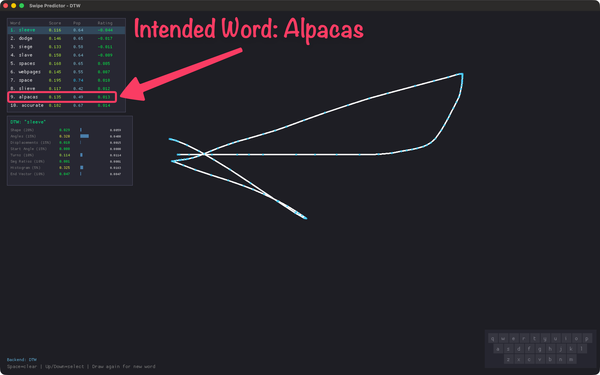
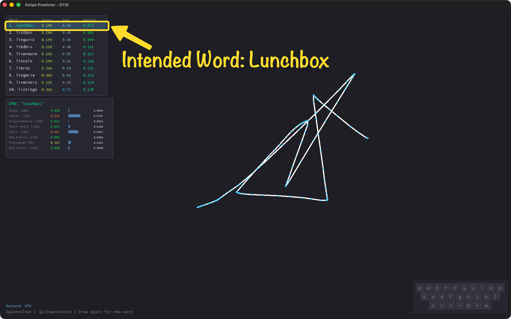

# Draw Swipe Predictor

Predict words purely from drawn keyboard key paths using either a DTW or CTC approach.

| `alpacas`                    | `lunchbox`                    |
| ---------------------------- | ----------------------------- |
|  |  |

As you can see, DTW was able to predict `lunchbox` much better than `alpacas` because the pattern is much more distinct for the latter word (when drawing without referencing a keyboard, of course, when trying to draw carefully, DTW can correctly identify both words).

## DTW (Dynamic Time Warping)

All features are **shape-intrinsic** — invariant to the scale, translation,
and rotation of the user's drawing, which is critical since users draw from
memory on a blank trackpad with no reference frame.

| Feature | Description | Type |
| ------------------- | -------------------------------------------------------------- | ------------------ |
| procrustes | Optimally-aligned shape distance (rotation + scale invariant)  | Shape-intrinsic |
| shape | Normalized resampled path (32 points, centered, length-scaled) | Shape-intrinsic |
| angular_dtw | DTW on turn-rate signatures (captures turn-by-turn rhythm)     | Shape-intrinsic |
| angles | Direction angles per segment (radians) | Sequential |
| displacements | Normalized displacement vectors per segment | Sequential |
| turn_angles | Turn angles (signed: +CCW/-CW) | Sequential |
| start_angle | First segment direction angle | Sequential |
| end_vector | Start-to-end displacement (normalized) | Global |
| aspect_ratio | Bounding box width/height | Global |
| straightness | Direct distance / path length | Global |
| total_turning | Sum of turn angles (complexity) | Global |
| segment_ratios | Segment lengths / total length | Sequential |
| direction_histogram | 8-bin direction distribution | Distribution |
| curvature | Turn angle normalized by segment length | Sequential |

Key novel techniques:
- **Procrustes alignment**: optimally rotates and scales the drawn path to match
  each candidate word template before measuring residual distance
- **Angular signature DTW**: compares the sequence of direction *changes* using
  DTW, inherently invariant to translation/scale/rotation
- **No position-based matching**: unlike traditional swipe keyboards, location
  distance is not used since the user's raw pixel positions have no meaningful
  relationship to keyboard key positions

## CTC (Connectionist Temporal Classification)

- Conv1D + **Relative Gesture Attention** + BiLSTM architecture
- **Feature masking**: randomly masks path segments during training for
  robustness to partially-recalled gestures
- Rich 7-dimensional input features: position, delta, angle, speed, curvature
- Warmup + cosine annealing learning rate schedule
- Decodes variable-length gestures into letter sequences
- Generalizes to unseen words

## Usage

```bash
# DTW backend
cargo run -p swipe-desktop --bin swipe-dtw

# CTC neural backend
cargo run -p swipe-desktop --bin swipe-ctc
```

## Training

See [training/README.md](training/README.md) for model training.

```
crates/swipe-engine/  # DTW + CTC inference engines
apps/desktop/        # UI with backend abstraction
training/            # CTC model training
```
